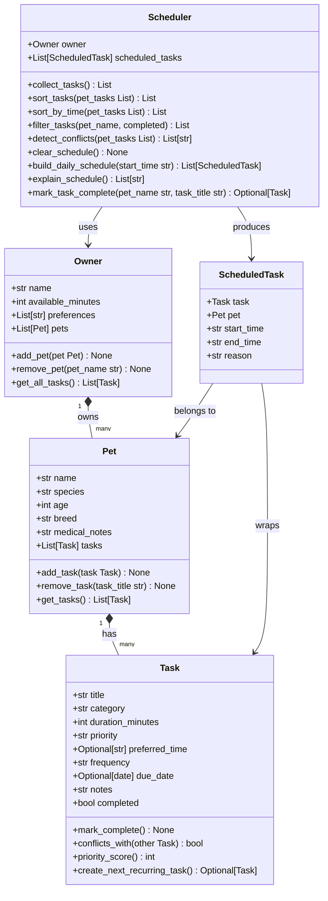

# PawPal+ (Module 2 Project)

**PawPal+** is a Streamlit web app that helps a busy pet owner track care tasks and generate a daily schedule for their pets. The backend logic is written in pure Python, with a clean separation between the data model, scheduling algorithm, and UI.

---

## System Overview

The app lets you:

- Enter owner info (name, available minutes per day)
- Add one or more pets (name, species, age, breed, medical notes)
- Add care tasks to each pet (feeding, walks, medication, grooming, etc.)
- Filter and sort tasks by pet or completion status
- Detect scheduling conflicts when two tasks share the same preferred time
- Generate a prioritized daily schedule that fits within the owner's time budget
- See a plain-English explanation of why each task was included

---

## UML Class Diagram



---

## Classes

### `Task`
Represents a single pet-care activity. Each task has a title, category, duration, priority (`low`, `medium`, `high`), an optional preferred time in `HH:MM` format, and a frequency (`once`, `daily`, `weekly`).

Key methods:
- `priority_score()` — converts the priority string to a number (high=3, medium=2, low=1) so tasks can be sorted
- `conflicts_with(other)` — returns `True` if two tasks share the exact same `preferred_time`
- `create_next_recurring_task()` — creates a copy of the task with a new due date (+1 day for daily, +7 days for weekly); returns `None` for one-time tasks

### `Pet`
Stores a pet's profile and its list of tasks. Supports adding and removing tasks by title.

### `Owner`
Stores the owner's name and how many minutes they have available today. Owns a list of `Pet` objects and provides `get_all_tasks()` as a convenience to collect every task across all pets.

### `ScheduledTask`
A lightweight wrapper that pairs a `Task` and its `Pet` with a calculated `start_time`, `end_time`, and a human-readable `reason` string.

### `Scheduler`
The core logic class. It holds an `Owner` and builds the daily plan through several steps:

1. `collect_tasks()` — gathers all incomplete tasks from all pets
2. `sort_tasks()` — sorts by priority descending, then preferred time ascending
3. `build_daily_schedule()` — iterates through sorted tasks and adds each one to the schedule as long as the cumulative duration stays within `owner.available_minutes`; tasks that would exceed the budget are skipped
4. `explain_schedule()` — returns one readable line per scheduled task describing why it was included
5. `detect_conflicts()` — flags any two tasks that share the same `preferred_time`
6. `mark_task_complete()` — marks a task done and automatically adds the next recurring copy to the pet's task list

---

## Scheduling Algorithm

`build_daily_schedule` uses a greedy approach:

1. Collect all incomplete tasks across all pets.
2. Sort them: **highest priority first**, then **earliest preferred time** as a tiebreaker. Tasks without a preferred time sort to the end.
3. Walk through the sorted list. For each task, check if `used_minutes + task.duration_minutes` exceeds the owner's available budget. If it fits, schedule it; if not, skip it.
4. Scheduled tasks are placed consecutively starting from `08:00`, using `_add_minutes()` to compute end times in `HH:MM` format.

**Tradeoff:** The scheduler does not rearrange tasks to pack the schedule more tightly — it processes them in priority order and skips anything that doesn't fit. This keeps the logic simple and the output predictable.

**Conflict detection** is separate from scheduling. It checks every pair of tasks and warns when two share the exact same preferred time string. It does not check for overlapping time ranges.

---

## Tests

Tests live in `tests/test_pawpal.py` and cover the most important behaviors:

| Test | What it verifies |
|------|-----------------|
| `test_mark_complete_changes_status` | `task.completed` flips from `False` to `True` after calling `mark_complete()` |
| `test_add_task_to_pet` | A task added to a pet appears in `pet.tasks` |
| `test_sort_by_time_returns_chronological_order` | `sort_by_time` returns tasks ordered earliest to latest regardless of insertion order |
| `test_daily_task_completion_creates_next_recurring_task` | Completing a `daily` task marks it done and appends a new task with `due_date + 1 day` |
| `test_conflict_detection_flags_duplicate_times` | Two tasks with the same `preferred_time` produce exactly one conflict warning containing that time |
| `test_pet_with_no_tasks_returns_empty_list` | `collect_tasks()` returns an empty list when no tasks exist |

Run the tests with:

```bash
pytest tests/
```

---

## Setup

```bash
python -m venv .venv
source .venv/bin/activate       # Windows: .venv\Scripts\activate
pip install -r requirements.txt
streamlit run app.py
```
